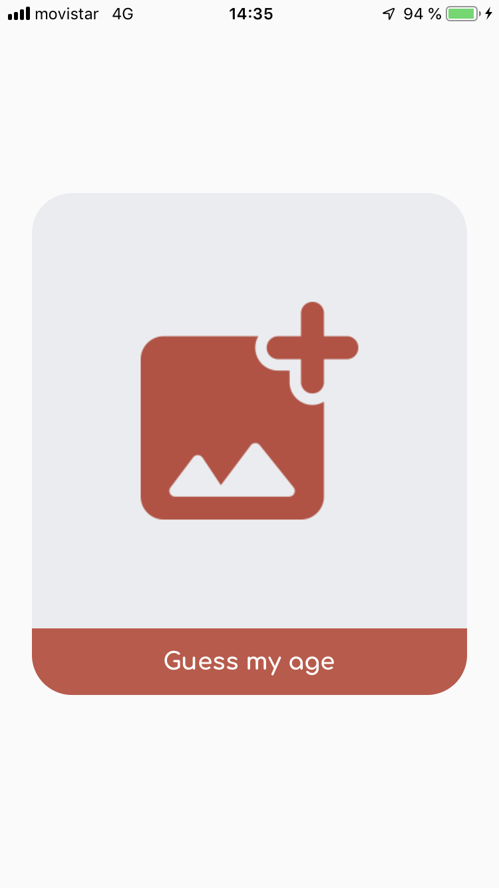
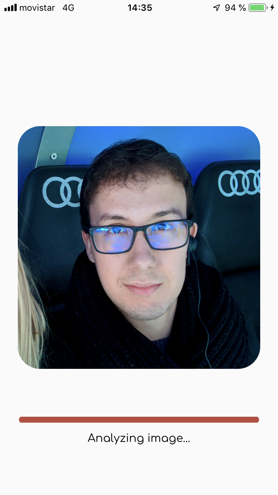
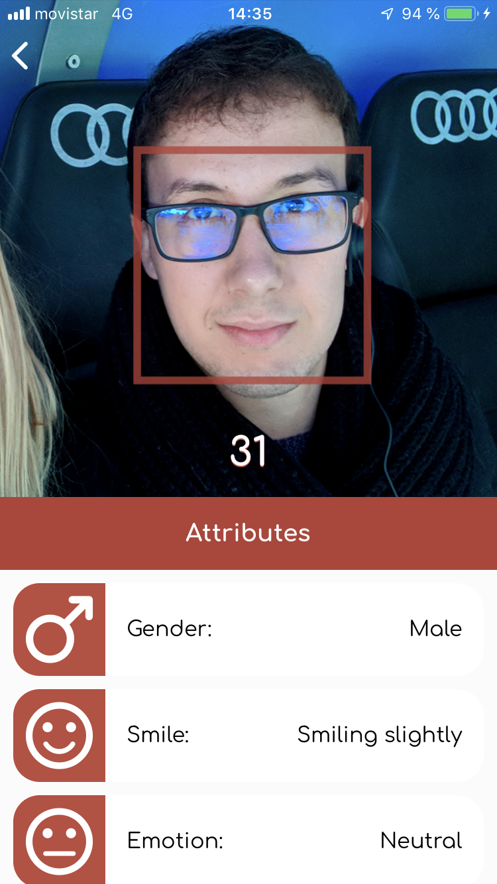
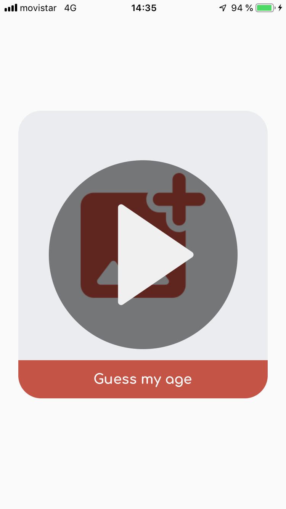

<h1>Guess My Age</h1>
<h2>IOS (Swift)</h2>
<b>Main tools</b>
<ul>
<li>Microsoft Face Api</li>
<li>Swifty Json</li>
</ul>

<h1>Description</h1>

Guess My Age determine the user age and other information from a profile picture.

This app uses the Face Api from Microsoft in order to analyze the content of a profile picture

This app is an academic/personal project which is only partially debugged and that needs some testing before being ready to be uploaded to the app store

<h1>Screenshots</h1>

  
  

  

<h1>Video</h1>

  

<h1>License</h1>

This repo acts like a portfolio and the app contained here <b>can't hold liability neither place warranty</b>. Furthermore, the final porpouse of this app is not decided yet, so in order to avoid problems in the future this repo has a <b>NonCommercial</b> CC-BY-NC license

 This work is licensed under a <a rel="license" href="http://creativecommons.org/licenses/by-nc-nd/4.0/">Creative Commons Attribution-NonCommercial-NoDerivatives 4.0 International License</a>.
